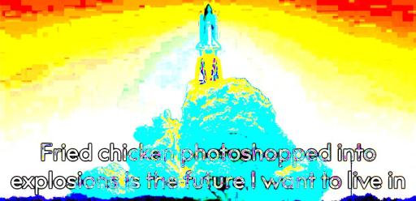

# Deep Phryer

*A Discord bot built in Python. Add the public bot to a server that you manage by clicking [this link](https://discordapp.com/oauth2/authorize?client_id=521562757787811841&scope=bot&permissions=100416).*

### Usage and Commands

##### Basics

This bot fries images! Specifically, it applies some color settings to a jpeg, png or gif file.

The bot is invoked with the command `FryThis`. If the originating message was not sent with an attachment, the bot will pick from a set of stock images. 

Some arguments are supported. Invoking with `params` will return the parameter set the image used in the response body. 
Some default color settings are supported: `galaxy`, `flir`, `classic`, `dark`. 
Adding the `link` paramter generates an HTTPS link to the resulting image. This link will be generated automatically if the resulting file is over 7.8 MB in size.
COMING SOON: The `chaos` argument on a GIF will pick parameters at random for each frame. Any other arguments will be ignored if this happens.

A help message will print with the command `deepfriedHELP`. It includes much of this information.

##### Example Usages:

| Command | Attachment | Example Image Result | Example Message |
| ------- | ---------- | -------------------- | --------------- |
| `FryThis dark params` | none | | ?????, you plebian.  Parameters:  Brightness: -100  Saturation: -200 |
| `FryThis flir link` | jpg |  | The image is located at https://extracrispy.net/deepfryt_yerm4s.jpg |
| `FryThis classic crispy params link` | gif |  | Parameters:  Brightness: 200  Saturation: 300  Frequency: 8 \n Phase shift: -45  Amplitude: 0.8  Bias: 0.6000000000000001  The image is located at https://extracrispy.net/deepfry3a3jv1v7.gif | 

### Get your own Phryer

If you don't want to deal with setting up your own infrastructure to host the bot, you can add the public bot to your server by clicking [this link](https://discordapp.com/oauth2/authorize?client_id=521562757787811841&scope=bot&permissions=100416). If you really want to run the bot yourself, read on!

##### Step 1
Go through the steps to create and authorize a bot on a Discord server. Steps are described [here](https://www.devdungeon.com/content/make-discord-bot-python), among other places.

##### Step 2
Clone this repository onto the machine you want to run the bot on. Use the following command:
`git clone https://github.com/etcadinfinitum/DiscordDeepPhryer.git`

##### Step 3
The script expects important data to be in a file called `creds.py`. Create this file within the repository folder created in Step 2, and add the following lines:

| Code Line | Data Needed | 
| --------- | ----------- | 
| `TOKEN = 'XXXXXX_YOUR_TOKEN_HERE_XXXXXXXXX'` | The bot's unique token, which can be obtained in the bot's administrative settings panel. Log in [here](https://www.discordapp.com/developers) with your server's credentials (refer to Step 1). | 
| `SUPPORT_LINKS = False` | A boolean value indicating whether or not external HTTP/S links to large images will be supported. Links will not be generated unless this value is set to `True`. |
| `PATH = ''` | The local destination filepath for content to be served via HTTPS. For nginx/apache, this usually looks like `/var/www/somthing/public_html/` |
| `URL = ''` | The domain name for the content to be served via HTTPS. For example, the public DeepPhryBot serves content at `https://extracrispy.net`. |

This file (`creds.py`) will be ignored in Version Control with the existing .gitigore. Proceed with caution when modifying this setting. 

##### Step 4
The bot requires Wand and imagemagick to be installed. Make sure you have the necessary packages installed; read the installation docs [here](http://docs.wand-py.org/en/0.4.1/guide/install.html).

### Long-Term Support

If you have a good idea, log an issue for the project. If you implement a good idea, submit a PR.

### Credits

This bot is licensed under GPL v3.0. Go forth and propogate, but do not privatize. See the LICENSE docs for more information.

This project was started by [Finn](https://github.com/thefinn93) as a [Signal](https://www.signal.org/) bot. Huge props to him for building much of the core functionality and for encouraging me to add support for GIFs. The original bot code is [here](https://git.callpipe.com/finn/deep-fried-sigger).
